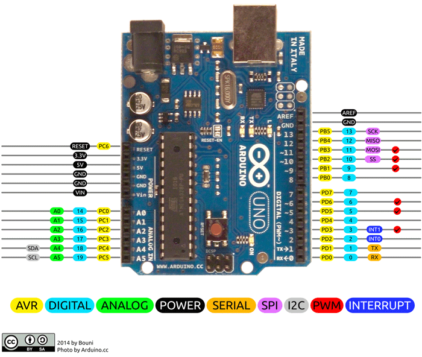

# Learn-IoT
This repository contains good resources to getting started with IoT. Here various sensor is used to connect with Arduino Uno and ESP32 and their program is available.

> Arduino Uno

> ESP32

